# Cobol-REKT (Cobol Reverse Engineering KiT)

[](https://github.com/avishek-sen-gupta/cobol-rekt/actions/workflows/maven-publish.yml)

You can see the current backlog [here](https://github.com/users/avishek-sen-gupta/projects/1).

## Contents

- [Introduction](#introduction)
- [Major Dependencies](#major-dependencies)
- [Reverse Engineering Use Cases](#reverse-engineering-use-cases)
- [Roadmap](#roadmap)
- [Flowchart Generation](#flowchart-generation)
- [Parse Tree Generation](#parse-tree-generation)
- [Control Flow Generation](#control-flow-generation)
- [Neo4J Integration](#neo4j-integration)
- [LLM-augmented Analysis](#llm-augmented-analysis)
  - [Depth-First Summarisation](#depth-first-summarisation)
  - [Building Glossaries](#building-glossaries-alpha)
  - [Building Capability Maps](#building-capability-maps-alpha)
- [Data Dependency Generation](#data-dependency-graph)
- [Comments integration](#comments-integration)
- [SMOJOL (SMol Java-powered CobOL) Interpreter](#smojol-smol-java-powered-cobol-interpreter)
- [Analysis through JGraphT](#analysis-through-jgrapht)
- [Useful Analyses through plain Python](#useful-analyses-through-plain-python)
  - [Analyse static value assignments to variables](#1-analyse-static-value-assignments-to-variables)
- [Analysis through NetworkX](#analysis-through-networkx)
    - [Code Similarity](#code-similarity)
    - [Code Pattern Recognition](#code-pattern-recognition)
- [Control Flow Analysis and Transpilation Experiments](#control-flow-analysis-and-transpilation-experiments)
  - [Intermediate Transpilation Model](#exposing-a-basic-transpilation-model-instructions-and-basic-blocks)
  - [Exposing Basic Blocks](#basic-blocks-experimental-feature)
  - [Reducibility Testing](#reducibility-testing)
    - [Reducibility testing using T1-T2 Transforms](#1-reducibility-testing-using-t1-t2-transforms)
    - [Reducibility testing using DJ Graphs](#2-reducibility-testing-using-dj-graphs)
  - [Irreducible Loop Detection](#improper-loop-detection)
    - [Loop Body Detection Heuristic using Strongly Connected Components](#1-improper-loop-heuristic-using-strongly-connected-components)
    - [Improper Loop Detection using DJ Graphs](#2-improper-loop-body-detection)
  - [Dominator Analysis](#dominator-analysis)
- [Running against AWS Card Demo](#running-against-aws-card-demo)
- [Developer Guide](#developer-guide)
  - [How to Build](#how-to-build)
  - [CLI Usage](#cli-usage)
  - [Programmatic Usage](#programmatic-usage)
  - [Logging Settings](#logging-settings)
- [Catalogue of Reusable Algorithms](#catalogue-of-reusable-algorithms)
- [A Note on Copyright](#a-note-on-copyright)
- [Caveats](#caveats)
- [Known Issues](#known-issues)

## Introduction
Cobol-REKT is an evolving toolkit of capabilities helpful for reverse engineering legacy Cobol code. As of now, the following capabilities are available:

- Program / section / paragraph level flowchart generation based on AST (SVG or PNG)
- Section-wise generation of Mermaid flowcharts
- Parse Tree generation (with export to JSON)
- Control Flow Tree generation (with export to JSON)
- Allows embedding code comments as comment nodes in the graph
- The SMOJOL Interpreter (WIP)
- Injecting AST and Control Flow into Neo4J
- Injecting Cobol data layouts from Data Division into Neo4J (with dependencies like MOVE, COMPUTE, etc.) + export to JSON
- Injecting execution traces from the SMOJOL interpreter into Neo4J
- Perform actions on graphs using depth first traversals in Neo4J (AST nodes or Data Structure nodes). Use cases can include aggregating lower-level summaries (using an LLM) into more abstract descriptions of functionality, a la GraphRAG.
- Exposes a unified model (AST, CFG, Data Structures with appropriate interconnections) which can be analysed through [JGraphT](https://jgrapht.org/), together with export to GraphML format and JSON.
- Support for namespaces to allow unique addressing of (possibly same) graphs
- Analysing static value assignments to variables
- Support for building Glossary of Variables from data structures using LLMs
- Support for extracting Capability Graph from paragraphs of a program using LLMs
- Injecting inter-program dependencies into Neo4J (with export to JSON)
- Paragraph similarity map (Java / Python)
- Code Pattern Detection (Neo4J / NetworkX)
- **(WIP)** Transpilation and Control Flow Analysis capabilities:
  - **Exposing a basic transpilation model** which is not tied to the COBOL syntax.
  - **Exposing Basic Blocks** which are a useful first step in raw transpilation
  - Calculating **limit flow graphs** using T1-T2 reductions: Analyse whether the control flow graph is reducible or not. This is a proxy for how well-structured the program is, and how amenable it is to direct transpilation to structured programming languages (without arbitrary GOTOs)
  - **Dominator Analysis:** This is the first step which forms the basis for techniques like detecting implicit loops, and correct scoping of any potential transpiled code in structured programming languages.


Cobol-REKT is more of a library of useful things intended to be embedded in more formal reverse engineering workflows/pipelines, rather than being a standalone tool (though you can certainly use it as such). Many of the higher-level wrappers are merely sensible defaults; you are encouraged to modify them to suit your needs.

**It is also to be noted that OpenAI integration is only attached to specific features. Much of the functionality of this toolkit is based on deterministic analysis.**

The toolkit consists of Java components, most of which are around parsing, ingestion of, and export from Cobol sources, and Python components, which carry out the analyses. In addition, the support for Neo4J allows you to build custom graph analyses as per your needs. I expect most of the analysis to happen through Python (using Neo4J or NetworkX), hence the Java component tries to unlock as much of the ingested data as possible in different formats.

**If you are trying out Cobol-REKT in your project, I'd love to know and feature it in the README (simply open a PR, and we can go from there)! I'm also welcoming contributors, and/or feature requests for your use cases.**

## Major Dependencies

- The toolkit uses the grammar available in the [Eclipse Che4z Cobol Support project](https://github.com/eclipse-che4z/che-che4z-lsp-for-cobol) to create the parse tree.
- The toolkit uses the API from [Woof](https://github.com/asengupta/woof) to interact with Neo4J.
- [Graphviz](https://graphviz.org/) for flowchart generation; see its documentation for OS-specific installation instructions.
- [JGraphT](https://jgrapht.org/) for Java-based graph analyses and some export functionality.
- [NetworkX](https://networkx.org/) for Python-based graph analyses
- An implementation of the gSpan algorithm for Frequent Subgraph Mining is adapted from [https://github.com/betterenvi/gSpan].
- [Neo4J](https://neo4j.com/) is required for using tasks involving Neo4J. The APOC and GDS plugins will need to be installed. All the tasks have also been tested using Neo4J Desktop.
- A subscription to OpenAI's GPT-4o (or your choice of deployment) will be needed for capabilities which use LLMs. The tasks have been tested using Azure's OpenAI offering.
- RuntimeTypeAdapterFactory from Gson for some serialisation use-cases.

## Reverse Engineering Use Cases

Some reverse engineering use cases are listed below. Descriptions of the capabilities which support these use cases are provided in later sections.

- The Parse Tree can be fed to a Graph DB for consumption by an LLM through agents to answer questions about the codebase
- Static analysis of the parse tree to reveal important operations (database operations, variable dependencies)
- The interpreter can be used to trace flows to experiment with different conditions
- Trace variable impact analysis (Which variables are affected by which in a particular run)
- Serve as input for LLM to explain specific flows in the program
- Serve as a proxy for testing behaviour at section/paragraph level if needed
- Identify dead code?
- Try out new rules?
- Identify different flows in the report - use cases for forward engineering

## Roadmap

- Integrating Domain Knowledge
- IDMS Identify UI interactions and participants (```INSPECT```, ```MAP IN```, ```INQUIRE MAP```, Panel Definition parsing)
- Eliminate GO TO's in intermediate representation, to enable transformation into structured programming constructs.
- Deeper Dataflow Analysis

## Flowchart Generation

This capability allows the engineer to transform Cobol source (or part of it) into a flowchart. The flowchart stays true to the source but omits syntactic noise to produce a detailed flow of logic through the source. The capability uses Graphviz to generate the flowchart images. The flowchart can be generated by specifying the ```DRAW_FLOWCHART``` task.

- Specifying the ```--generation``` parameter as ```SECTION``` creates one flowchart per section, while specifying the value as ```PROGRAM``` generates one flowchart for the entire program.
- You can specify the output format as SVG or PNG by setting ```--fileOutputFormat``` to ```SVG``` or ```PNG``` respectively.

### Example flowchart of the program test-exp.cbl


### Interpreting the Flowchart

The dotted lines indicate things that are inside a node. So, in the above example, after the first beige "Processing" block, there is a node which leads to an IF statement through the dotted line. What happens inside the IF statement can be understood by "stepping into" this dotted line. The normal flow after the IF statement finishes can be continued by returning to the node where the dotted line originates.

You can also generate Mermaid flowcharts for embedding in other Markdown files. You can use the ```EXPORT_MERMAID``` task for this. Currently, this supports only section-wise generation of Mermaid charts.

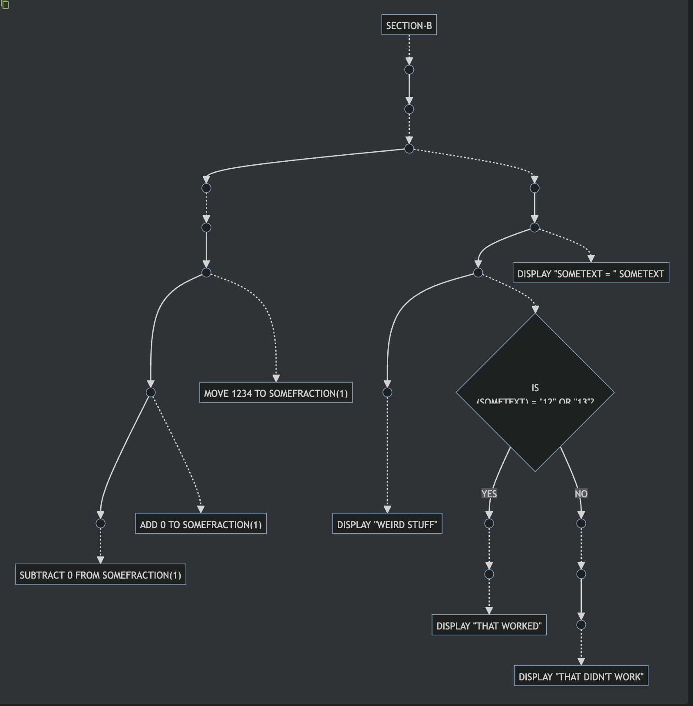

## Parse Tree Generation

This allows the engineer to produce the parse tree of Cobol source. This is suitable for use in further static analysis, transformation (into a control flow tree, for example), and inputs to other systems (informed chunking to an LLM, into a graph database for further exploration, etc.). See [Reverse Engineering Use Cases](#reverse-engineering-use-cases) for more examples.

Most of the capabilities are already present in the Che4z library. Some new grammars have been added. They are:

- IDMS panel definitions which are used in user interfaces
- Cobol Data Layouts, which are used in defining the records in the DATA DIVISION

This capability can be used by specifiying the ```WRITE_RAW_AST``` task.

## Control Flow Generation

This capability allows the engineer to produce a control flow tree for the Cobol source. This can be used for straight-up visualisation (the flowchart capability actually uses the control flow tree behind the scenes), or more dynamic analysis through an interpreter. See [SMOJOL (SMol Java-powered CobOL Interpreter)](#smojol-smol-java-powered-cobol-interpreter) for a description of how this can help.

The CFG generation is part of the ```INJECT_INTO_NEO4J``` task.

Note that this is not the same control flow model which is used in the transpiler tasks. For that, see [Experiments in Transpilation](#control-flow-analysis-and-transpilation-experiments).

## Neo4J Integration

Both the AST and the Control Flow Graph can be injected directly into Neo4J. The AST injected can be in the same format as the SMOJOL interpreter, or the bare parse tree generated by ANTLR.
The Control Flow Graph is in the SMOJOL AST format.

When generating the AST and CFG, the library allows configuring them to be the same, i.e., the same nodes are reused for creating both AST and CFG connections. For example, in the screenshot below: the same CFG has ```CONTAINS``` (AST relationship), ```FOLLOWED_BY``` (CFG relationship), and the ```MODIFIES```/```ACCESSES``` relationships (data structure relationship).

This provides a rich unified view of the entire program, without having to jump between multiple disconnected views of the source code, for analysis.

This can be done by specifiying the ```INJECT_INTO)NEO4J``` task.


## LLM-augmented Analysis

### Depth-First Summarisation

The OpenAI integration can be leveraged to summarise nodes in a bottom-up fashion (i.e., summarise leaf nodes first, then use those summaries to generate summarise the parent nodes, and so on).

The following diagram shows the AST, the Control Flow Graph, and the data structures graph. The yellow nodes are the summary nodes (generated through an LLM) attached to the AST (to provide explanations) and the data structures (to infer domains).

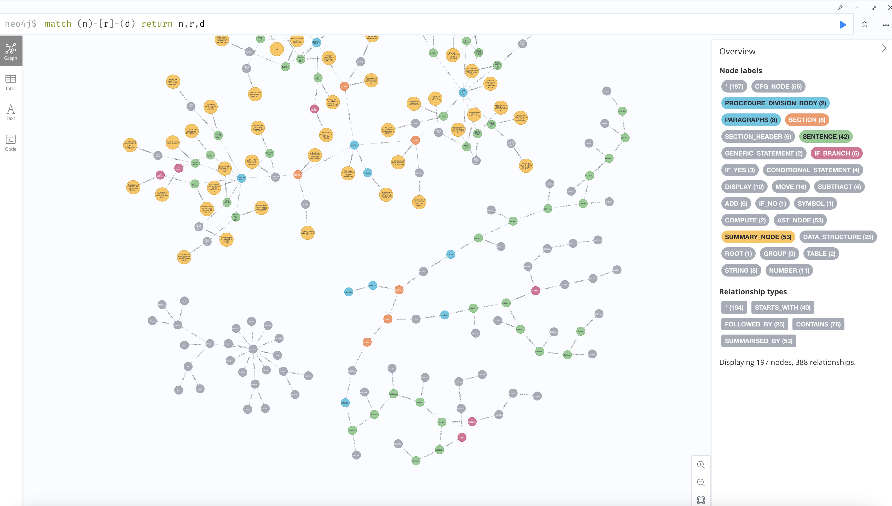

### Building Glossaries **(ALPHA)**

The toolkit supports building glossaries of variables given the data structures in a program. This capability is provided through Python in the ```smojol_python``` component.
To use this facility, start by exporting the data structures to JSON, through the JAR, like so:

```
java -jar smojol-cli/target/smojol-cli.jar run YOUR_PROGRAM --commands="WRITE_DATA_STRUCTURES" --srcDir /path/to/sources --copyBooksDir /path/to/copybooks --dialectJarPath che-che4z-lsp-for-cobol-integration/server/dialect-idms/target/dialect-idms.jar --dialect IDMS --reportDir /path/to/report/dir
```

This will generate a JSON file in ```/path/to/report/dir```. After this, you can run:

```
cd smojol_python
python -m src.llm.glossary_builder.main /path/to/report/dir/program-data.json out/glossary.md
```

This will generate the glossary in ```out/glossary.md```. Integrating other out-of-band data sources is a work in progress.

### Building Capability Maps **(ALPHA)**

The toolkit supports extracting a capability map from the paragraphs of a source. For this, you need to generate both the AST in Neo4J, as well as the data structures JSON, you can do this via:

```
java -jar smojol-cli/target/smojol-cli.jar run YOUR_PROGRAM --commands="INJECT_INTO_NEO4J WRITE_DATA_STRUCTURES" --srcDir /path/to/sources --copyBooksDir /path/to/copybooks --dialectJarPath che-che4z-lsp-for-cobol-integration/server/dialect-idms/target/dialect-idms.jar --dialect IDMS --reportDir /path/to/report/dir
```
After this, you will want to extract the paragraph capabilities, like so:

```
python -m src.llm.capability_extractor.paragraph_capabilities /path/to/data/structures/json /paragraph/capabilities/output/path ../paragraph/variables/explanation/output/path
```

This will generate the capabilities in ```/paragraph/capabilities/output/path```. At this point, you may need to clean parts of the output manually, if some entries do not correpond to a comma-separated list of domain terms (efforts to eliminate this manual process are in progress).

The final step is to actually generate the capability map:

```
python -m src.llm.capability_extractor.capabilities_graph /paragraph/capabilities/output/path
```

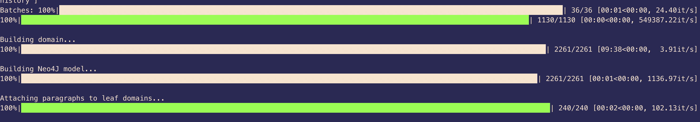

This will take a little time, depending upon the number of paragraphs and their sizes. At the end, it will generate a dendrogram visualisation, as will as the capability map in Neo4J, as illustrated below (for a 10000+ line COBOL program).

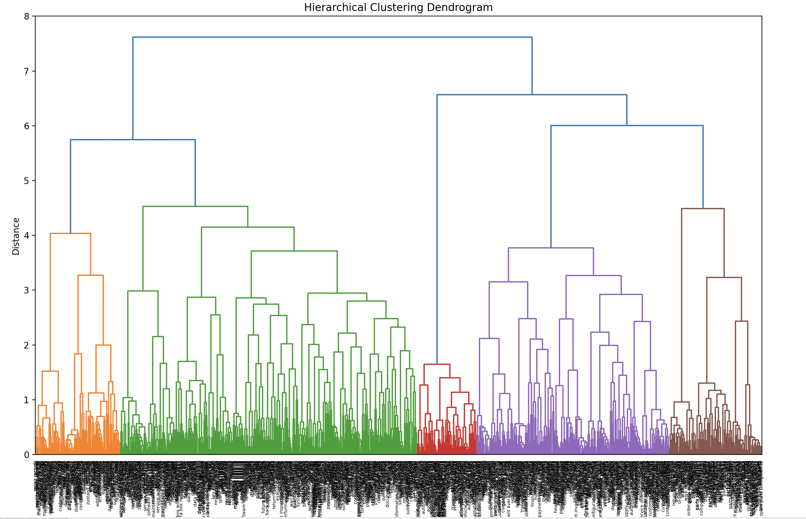

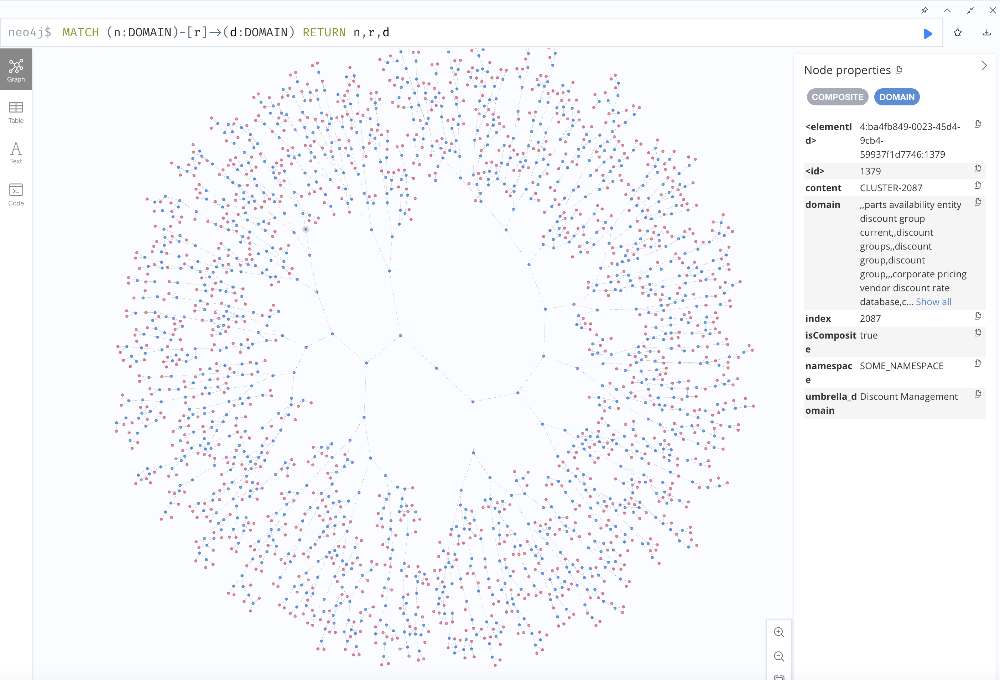

## Data Dependency Graph

This capability connects records which modify other records, with a ```FLOWS_INTO``` relation. The dependencies traced include variables which are used in expressions, as well as free-standing literals. Below is an example of a set of record dependencies from a program. It also generates connections based on REDEFINES clauses.

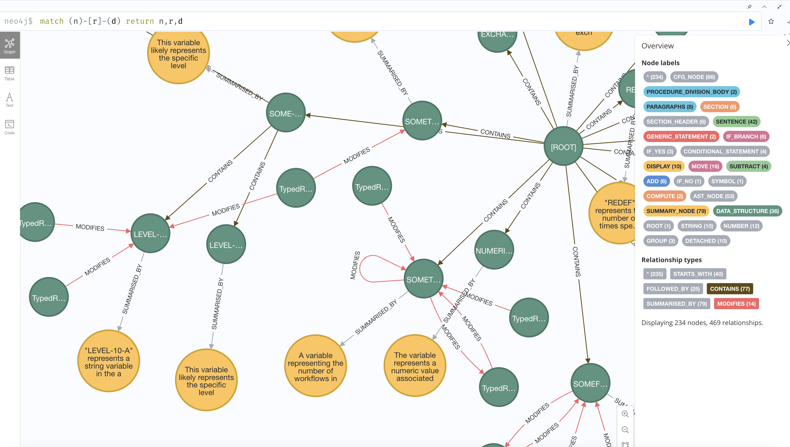

## Comments Integration

This capability connects comments to the nearest subsequent node, with a ```HAS_COMMENT``` connection. This works for comments in the PROCEDURE division and all data structures. Comments before copybooks are connected to the main program node. Any comments which cannot be attached to found nodes, end up being connected to the main program node.

This can be done by specifying the ```ATTACH_COMMENTS``` task. Note that for the comment nodes to appear in the graph, the ```INJECT_INTO_NEO4J``` task must appear after the ```ATTACH_COMMENTS``` task.

The example below shows all node-comment sets for a reasonably large program.

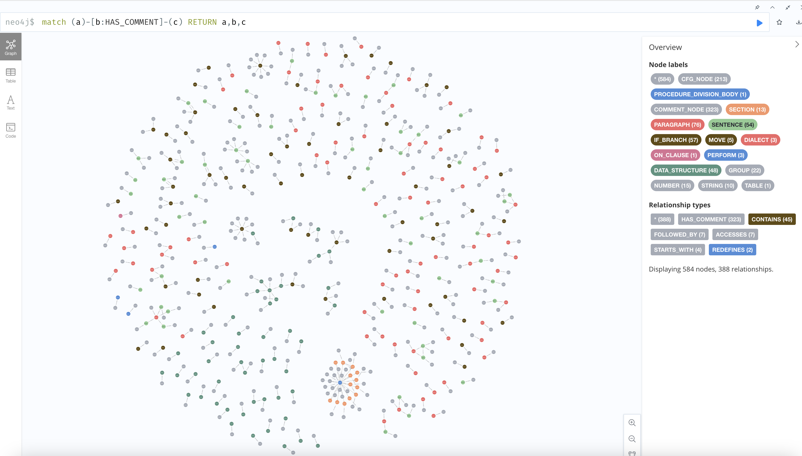

## SMOJOL (SMol Java-powered CobOL) Interpreter

The interpreter is a natural extension to building the parse tree for a Cobol source. Since syntax nodes are temporally ordered, it is possible to build an execution tree which covers all possible flows. This is the basis for flowchart generation, and also the basis for a tree-walk interpreter. The interpreter sets up the AST which is a projection of the parse tree more suitable for execution. Parts of the interpreter convert specific nodes in the AST into more suitable forms at runtime (for example, expression evaluation).

The primary motivation for the interpreter is to be able to simulate the execution of programs (or fragments of programs) in a sandboxed environment where the engineer needn't worry about fulfilling dependencies required to run the code in a true mainframe environment. Rather, they can inject these dependencies (values of variables, for example) as they see fit, to perform their true task: namely, performing control flow analysis.

The interpreter can run in two modes:

- **No-Operation mode:** In this mode, none of the processing statements like MOVE, ADD, etc. are actually executed, but control flow is still respected. This mode is useful in many contexts where the actual change in variables isn't as important as knowing / logging the action that is taking place. This is a good default starting point for ingesting runtime execution paths into a graph. Decisions which affect control flow are evaluated based on the kind of evaluation strategy specified, so the full expression evaluation strategy will not be effective. More specific strategies can be written, or interactive resolution through the console can be used.
- **Full evaluation mode (Experimental):** In this mode, expressions are actually evaluated to their final results, and is the closest to actual execution of the program including storing variable state. Note that this is a work in progress, since every nook and cranny of the Cobol standard is not supported yet.

### Current Capabilities of the Interpreter

- Support for most control constructs: IF/THEN, NEXT SENTENCE, GO TO, PERFORM, SEARCH...WHEN, IDMS ON
- Support for expression evaluation in COMPUTE, MOVE, ADD, SUBTRACT, MULTIPLY, DIVIDE
- Support for interactive resolution of conditions
- Most common class comparisons supported
- Support for abbreviated relation condition forms (IF A > 10 OR 20 AND 30...)
- Functioning type system (supports zoned decimals, COMP-3 / Packed Decimal and alphanumerics) with a large subset of z/OS behaviour compatibility for scenarios undefined in the Cobol standard
- Support for fixed-size tables and single subscripting
- Support for elementary, composite, and recursive REDEFINES (REDEFINES of REDEFINES)
- Multiple subscript access
- Automatic detection of types from DATA DIVISION specifications
- Supports evaluation of level 88 variables
- Support for tracking variable state
- Set breakpoints based on conditions or specific AST node
- View current stack at a breakpoint
- View variable values at a breakpoint
- Support for different strategies to deal with unresolved record references (ignore / throw exception)
- Support for listeners to extract specific information about the current state of the program (all the Neo4J integrations are via these listeners)

### Planned Capabilities for the interpreter

- Support symbolic execution
- Support EVALUATE statements
- PERFORM VARYING
- PERFORM INLINE...VARYING
- Initialise values of variables from DATA DIVISION
- Support for floating point and alphabetic
- Support for REDEFINES larger than original record
- Variable snapshot per stack frame
- Evaluate IDMS expressions
- ON clauses on common operations
- ...

### Example interpreter session demonstrating breakpoints, stack traces, and record inspection
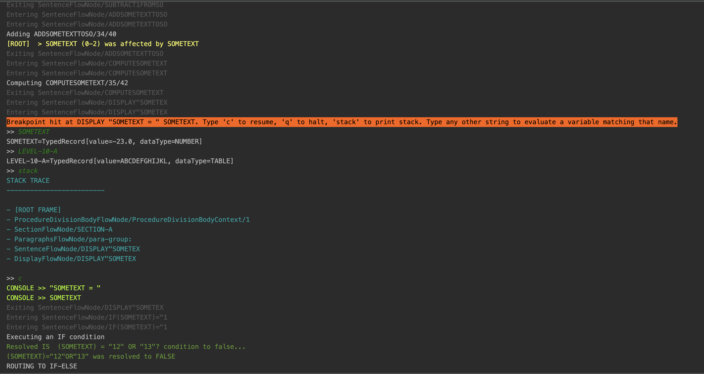


### Integration with Neo4J

The interpreter also supports injecting a complete execution path through the program into Neo4J. The screenshot below shows the execution trace of a reasonably complex program.

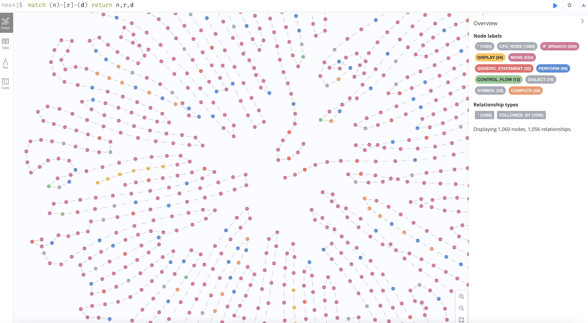

## GraphML Export
You can export to GraphML from Neo4J pretty easily. If you don't have Neo4J set up though, the toolkit allows exporting the following entities to the GraphML format (with all interconnections) as a single supergraph, so that they can be consumed further downstream for analysis:

- Abstract Syntax Tree (the ```WRITE_FLOW_AST``` task)
- Control Flow Graph (the ```WRITE_CFG``` task)
- Data Structures + Dependencies (included under both of the above tasks)

The screenshot below shows a sample program's unified model exported to GraphML and loaded through the yEd Graph Editor.

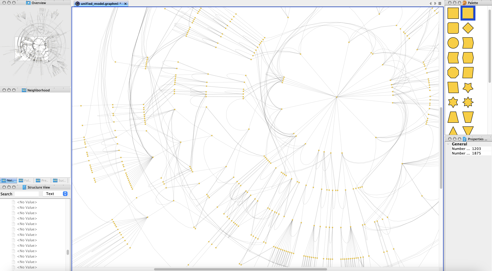

To export the unified graph to GraphML from Neo4J, you can run the following command:

```
CALL apoc.export.graphml.all("<export.graphml>", {})
```

The file will be in the ```import``` directory inside the directory where the current database files are stored (in Neo4J Desktop).

## Analysis through JGraphT

In addition to writing to Neo4J and leveraging its data science capabilities to analyse the graph(s), the library also embeds [JGraphT](https://jgrapht.org/), a powerful library of graph algorithms. The ```JGraphTBuilder``` class converts the unified model (AST, CFG, Data Structures) into a DirectedPseudograph (because there can be both loops and parallel edges between two nodes), for consequent analysis through the JGraphT API.

Custom analyses are a work in progress. The ```COMPARE_CODE``` task, for example, uses the JGraphT library.

## Useful Analyses through plain Python

### 1) Analyse static value assignments to variables

This is useful for when you are looking for the range of values which are assigned to a record in a program. You will need to execute the ```WRITE_RAW_AST``` task first, like so:

```
java -jar smojol-cli/target/smojol-cli.jar run test-exp.cbl hello.cbl --commands="WRITE_RAW_AST" --srcDir /Users/asgupta/code/smojol/smojol-test-code --copyBooksDir /Users/asgupta/code/smojol/smojol-test-code --dialectJarPath ./che-che4z-lsp-for-cobol-integration/server/dialect-idms/target/dialect-idms.jar --reportDir out/report --generation=PROGRAM
```

Once you have the AST file, you can run the analysis like so (making sure first that you are in the ```smojol_python``` directory):

```
python -m src.analysis.variable_static_values /path/to/ast/json --output=/path/to/output
```

If you omit the ```--output``` flag, it will simply print out the results.

## Analysis through NetworkX

If you export the Unified Model to JSON, you can import it into NetworkX quite easily. The ```unified_model_to_networkx``` script lets you ingest the JSON and create both the fully-connected NetworkX graph, as well as the in-memory Python equivalent of the Unified Model. You're free to extract out specific parts of the model through convenience functions. The following code extracts out the AST, CFG, and the data structures separately. You can customise extraction for your use case; take a look at any one of those convenience methods for guidance.

```
with open(input_path, 'r') as file:
    unified = json.load(file)
    ast_x, _, _ = extract_ast(unified)
    cfg_x, _, _ = extract_cfg(unified)
    ds_x, _, _ = extract_ds(unified)
```

There are currently two tasks implemented using NetworkX.

### Code Similarity

TODO...
See ```similarity.py```.

### Code Pattern Recognition

It is very easy to do pattern matching in Neo4J, so you might choose to use those facilities instead (see [Analysis through Neo4J](#analysis-through-neo4j)). However, pattern matching is also possible using NetworkX directly using subgraph isomorphisms.

You will need to construct the subgraph pattern through code, which is not as elegant as writing Cypher queries, but it does work. See ```pattern_matcher.py``` for an example.

## Analysis through Neo4J

### Code Pattern Recognition

You can match patterns pretty easily through Cypher. See ```neo4j_pattern_matcher.py``` for an example of how to match a call pattern, i.e., a bunch of sequential ```MOVE``` statements, followed by a ```CALL``` statement. The patterns being developed are documented in ```neo4j_pattern_queries.py```.


You can find some useful Neo4J-based analysis queries in [Analysis](neo4j-analysis.md)

## Control Flow Analysis and Transpilation Experiments

Most of the tasks in this category are meant to be used as part of a larger analysis workflow, and thus do not have any filesystem outputs. All the analyses use JGraphT's ```DefaultDirectedGraph``` for representing and manipulating graph structures.

### Exposing a basic transpilation Model (Instructions and Basic Blocks)

This target exposes a basic transpilation model which is not tied to the COBOL syntax. It uses only assignments, loops, conditions, and jumps to represent most of COBOL syntax. The result may not still be well-structured because of arbitrary GOTOs. This will be the input for further control flow analysis tasks.

The model currently consists of the following:

- **The transpiler syntax tree:** The original intermediate tree representation from which instructions and the control flow graph are generated.
- **Transpiler instructions:** This has the instructions laid out serially. It is primarily used to resolve locations for instructions like ```break``` and ```NEXT SENTENCE```. Note that sentinel instructions are present in this sequence, like ```ENTER```, ```EXIT```, and ```BODY```.
- **Transpiler instruction Control Flow Graph**: This is generated from the instruction sequence above, and thus the nodes are the transpiler instructions (including sentinel instructions).
- **List of Basic Blocks**: This is generated from the instruction sequence, and represent blocks of code where the only join point is (possibly) the first instruction in the block, and the only join point is (possibly) the last instruction in the block. For more information, see [Basic Blocks](#basic-blocks-experimental-feature).

For example, if we have a ```EVALUATE``` statment like the following:
```
        EVALUATE TRUE ALSO TRUE
              WHEN SCALED + RESULT < 10 ALSO INVOICE-AMOUNT = 10
                MOVE "CASE 1" TO SOMETHING
              WHEN SCALED + RESULT > 50 ALSO
                INVOICE-AMOUNT = ( SOMETEXT + RESULT ) / SCALED
                MOVE "CASE 2" TO SOMETHING
              WHEN OTHER
                MOVE "CASE OTHER" TO SOMETHING
            END-EVALUATE
```

Then, the following is an example of the text representation of the transpiler tree of the above statement (formatted for clarity):

```
if(and(eq(primitive(true), lt(add(ref('SCALED'), ref('RESULT')), primitive(10.0))), eq(primitive(true), eq(ref('INVOICE-AMOUNT'), primitive(10.0))))) 
 then 
{
	CODE_BLOCK: CODE_BLOCK: set(ref('SOMETHING'), value(primitive("CASE 1"))) 
}
 
else 
{
	if(and(eq(primitive(true), gt(add(ref('SCALED'), ref('RESULT')), primitive(50.0))), eq(primitive(true), eq(ref('INVOICE-AMOUNT'), divide(add(ref('SOMETEXT'), ref('RESULT')), ref('SCALED')))))) 
	 then 
	{
		 CODE_BLOCK: CODE_BLOCK: set(ref('SOMETHING'), value(primitive("CASE 2"))) 
	}
	 
	else 
	{
		 CODE_BLOCK: CODE_BLOCK: set(ref('SOMETHING'), value(primitive("CASE OTHER"))) 
	}
}
```

As another example, let's take a ```PERFORM INLINE``` statement which looks like so:

```
PERFORM TEST BEFORE VARYING SOME-PART-1 FROM 1 BY 1
UNTIL SOME-PART-1 > 10
AFTER SOME-PART-2 FROM 1 BY 1 UNTIL SOME-PART-2 > 10
    DISPLAY "GOING " SOME-PART-1 " AND " SOME-PART-2
END-PERFORM.
```
The intermediate representation looks like the following:

```
loop[loopVariable=ref('SOME-PART-1'), initialValue=primitive(1.0), maxValue=NULL, terminateCondition=gt(ref('SOME-PART-1'), primitive(10.0)), loopUpdate=primitive(1.0), conditionTestTime=BEFORE] 
{
	loop[loopVariable=ref('SOME-PART-2'), initialValue=primitive(1.0), maxValue=NULL, terminateCondition=gt(ref('SOME-PART-2'), primitive(10.0)), loopUpdate=primitive(1.0), conditionTestTime=BEFORE] 
	{
		CODE_BLOCK: print(value(primitive("GOING ")), value(ref('SOME-PART-1')), value(primitive(" AND ")), value(ref('SOME-PART-2')))
	}
}
```

The screenshot below shows a part of an example transpiler model flowgraph.

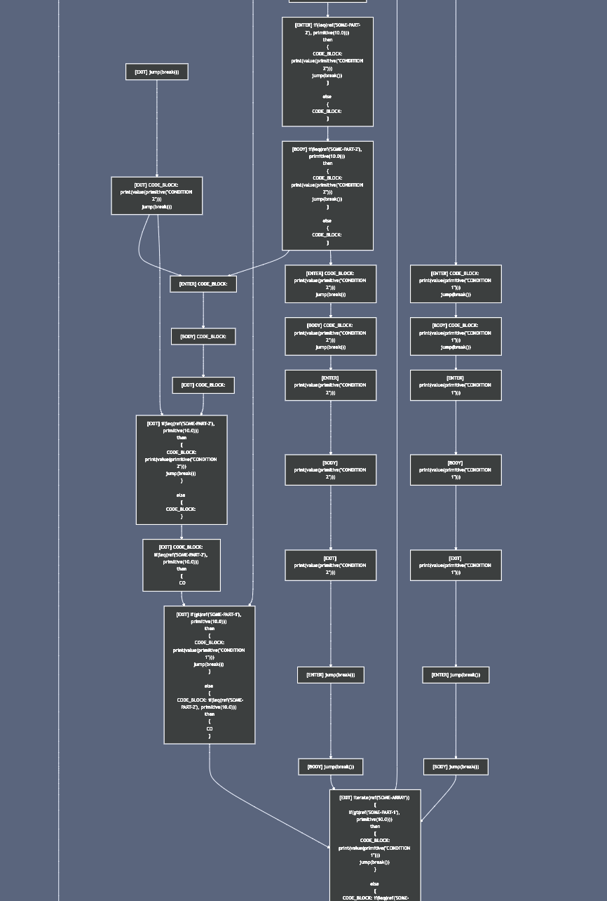

See [TranspilerBuildMain.java](smojol-toolkit/src/main/java/org/smojol/toolkit/examples/TranspilationMain.java) for an example.

The ```BuildTranspilerFlowgraphTask``` creates the intermediate AST, instructions, and the **Basic Block tree**.

In addition, this task can accept a set of flow hints. These flow hints allow the engineer to explicitly specify section/paragraph names which are not targets of fallthrough flows. Without these hints, some programs can yield irreducible control flowgraphs, which require more complicated resolutions, come transpilation time. See [Reducibility Test](#reducibility-testing) for more details.

### Details of the Intermediate Transpiler Tree

- ```SEARCH-WHEN``` statements are translated into collection iterations (with breaks) and conditions.
- ```EVALUATE``` statements are translated into loops and conditions.
- ```NEXT SENTENCE```, ```GO TO```s (conditional and unconditional) are translated into static jumps with appropriate conditionals.
- ```PERFORM INLINE``` statments are translated into code blocks (enclosed in loops if there is a ```VARYING``` clause).
- ```PERFORM``` procedure calls are converted into jump calls which can contain a start and stop code block (for ```THROUGH``` clauses). Loops are added for ```VARYING``` clauses.
- Sections and paragraphs are converted into labelled aggregate blocks of code. Sentences are converted into unlabelled code blocks, but with metadata identifying them as sentences (for purposes of resolving ```NEXT SENTENCE``` locations).
- ```MOVE``` is converted into assignments.
- Operations like ```COMPUTE```, ```ADD```, ```SUBTRACT```, ```MULTIPLY```, and ```DIVIDE``` are converted into sequences of expressions with explicit assignments (to account for ```GIVIING``` phrases).
- Any instructions not currently supported are converted into placeholder nodes.

### Basic Blocks (Experimental Feature)

**Basic Blocks** are useful for analysing flow of the code without worrying about the specific computational details of the code. They are also useful (and the more pertinent use-case in our case) for rewriting / transpiling potential unstructured COBOL code (code with possibly arbitrary GOTOs) into a structured form / language (i.e., without GOTOs).

Exposing basic blocks is done through the ```BuildBasicBlocksTask``` task. Note that this task does not actually output any artifacts, because it is intended for more internal analysis and transpilation (if I get to it at some point). Each ```BasicBlock``` contains a list of straight-line ```TranspilerInstruction```s.

Note that if you use the ```BuildTranspilerFlowgraphTask``` task, Basic Blocks are automatically generated for you.

### Reducibility Testing

[TODO: Write about reducibility]

#### 1. Reducibility Testing using T1-T2 Transforms

**Reducibility** is tested using interval analysis, specifically using the **repeated T1-T2 transform method**.

See [TranspilerInstructionIntervalAnalysisMain.java](smojol-toolkit/src/main/java/org/smojol/toolkit/examples/TranspilerInstructionIntervalAnalysisMain.java) for an example.

#### 2. Reducibility Testing using DJ Graphs

A second technique for testing reducibility follows the method outlined in [[Sreedhar-Gao-Lee, 1996]](https://dl.acm.org/doi/pdf/10.1145/236114.236115).
- ```BuildDJTreeTask```: This creates the DJ tree using the dominator tree. It uses the output of the ```BuildDominatorTreeTask``` as its input. See [Dominator Analysis](#dominator-analysis) for more details.
- ```ReducibleFlowgraphTestTask```: This is the actual test which determines if a flowgraph is reducible or not.

### Improper Loop Detection

#### 1. Improper Loop Heuristic using Strongly Connected Components

**Strongly Connected Components** in a flowgraph represent the most general representation of looping constructs. Proper SCC's have only one node in them that can be the entry point for any incoming edge from outside the SCC. These are **natural loops**. Having multiple entry points implies that there are arbitrary jumps into the body of the loop from outside the loop, which makes the loop improper, and consequently the graph, irreducible.

It is important to note that even if no improper SCC's are detected, it does not imply that the flowgraph is reducible. See the flowgraph built in ```counterExample()``` in ```ReducibleFlowgraphTest``` for an example of such pathological graphs.

Proper SCC's are a necessary condition for a reducible flowgraph, but not a sufficient condition. The sufficient condition is that no **strongly connected subgraph** be improper. However, SCC's are **maximal strongly connected subgraphs**, which means they can contain improper strongly connected subgraphs _inside_ them, which is why the distinction is important.

This is, however, a good test which can surface loop-specific reducibility problems. The test is done using the ```IrreducibleStronglyConnectedComponentsTask``` task.

Strongly Connected Components are detected using JGraphT's built-in [Kosarajau's algorithm for finding SCC's](https://jgrapht.org/javadoc/org.jgrapht.core/org/jgrapht/alg/connectivity/KosarajuStrongConnectivityInspector.html).

#### 2. Improper Loop Body Detection

The technique of testing flowgraph reducibility in the [previous section](#2-reducibility-testing-using-dj-graphs) also extends to finding the all loop bodies, both reducible and irreducible. See ```LoopBodyDetectionTask```.

### Dominator Analysis

Several tasks are required to be run to do dominator analysis.

- ```DepthFirstTraversalLabelTask```: This creates the actual depth-first post order labelling that will be used to build dominator lists. Note that task can be applied either to the raw ```TranspilerInstruction``` flowgraph, or the ```BasicBlock``` one, depending upon your preference. See [Reusable Algorithms](#catalogue-of-reusable-algorithms) for more details.
- ```BuildDominatorsTask```: This creates the actual dominator lists. Immediate dominators can be accessed using the ```immediateDominators()``` method. All possible dominators for all the nodes in the flowgraph can be accessed using the ```allDominators()``` method.
- ```BuildDominatorTreeTask```: This creates the dominator tree which is used to detect irreducible loops using the algorithm as outlined in [[Sreedhar-Gao-Lee, 1996]](https://dl.acm.org/doi/pdf/10.1145/236114.236115). It uses the output of the ```BuildDominatorsTask``` as its input.

See [DominatorAnalysisMain.java](smojol-toolkit/src/main/java/org/smojol/toolkit/examples/DominatorAnalysisMain.java) for an example.

## Running against AWS Card Demo

The library has been tested (validation, flowchart generation, AST generation, Unified Model generation) against the [AWS Card Demo](https://github.com/aws-samples/aws-mainframe-modernization-carddemo) codebase. To run it against that codebase, do the following:

- Clone the repository
- Create an empty file ```app/cpy/DFHAID```
- Create an empty file ```app/cpy/DFHBMSCA```

Now run your commands as usual.

## Developer Guide

### How to Build

The toolkit uses JDK 21 features; so you'll need the appropriate JDK set up.

Run: ```mvn clean install```.

The Checkstyle step is only applicable for the Eclipse Cobol parser project. You can skip the Checkstyle targets with:

```mvn clean verify -Dcheckstyle.skip=true```

You can skip the tests as well, using:

```mvn clean verify -Dmaven.test.skip=true```

For generating flowcharts, you will need to set up Graphviz on your box; see the [site](https://graphviz.org/) for OS-specific installation instructions.

Before using any of the Python components, you will need to install dependencies, like so:

```
cd smojol_python
pip install -r requirements.txt
```

### CLI Usage
The individual functionalities in the Java component can be invoked using different commands. Further tasks / commands will be added.

#### Command: ```run```

This command encapsulates almost all the tasks that you are likely to run. The descriptions of the various commands are listed below.

- ```WRITE_FLOW_AST```: Writes a more useful form of the AST to JSON. This form is used by the interpreter and other analyses.
- ```INJECT_INTO_NEO4J```: This injects the unified model into Neo4J. Exposing more fine-grained options is in progress. This requires the environment variable ```NEO4J_URI```, ```NEO4J_USERNAME```, and ```NEO4J_PASSWORD``` to be defined. If you wish to include comments in the graph, the ```ATTACH_COMMENTS``` needs to have run first.
- ```ATTACH_COMMENTS```: This parses the original source file (excluding copybooks for now) to find comments and attach them to the nearest subsequent AST node.
- ```EXPORT_TO_GRAPHML```: This exports the unified model to GraphML. Exposing more fine-grained options is in progress.
- ```WRITE_RAW_AST```: This writes the original parse tree to JSON. Useful for downstream code to build their own AST representations.
- ```DRAW_FLOWCHART```: This outputs flowcharts for the whole program or section-by-section of the program in PNG format.
- ```EXPORT_MERMAID```: This outputs section-wise (one file per section) flowcharts for the program in the Mermaid format.
- ```WRITE_CFG```: This outputs the control flow graph of the program as JSON.
- ```WRITE_DATA_STRUCTURES```: This exports the data structure hierarchy of the program as JSON.
- ```BUILD_PROGRAM_DEPENDENCIES``` (ALPHA): Builds direct program dependencies from ```CALL``` and IDMS ```TRANSFER CONTROL``` statements. Indirect dependencies are not traced. For tracing the full dependency graph, see the ```dependency``` task.
- ```COMPARE_CODE``` (ALPHA): Builds a map of inter-paragraph similarity based on node edit distances (using the Zhang-Shasha algorithm). Work in Progress.
- ```SUMMARISE_THROUGH_LLM```: Summarises nodes depth-first, but starting at the leaves using an LLM.

For example, if you wanted to run all of the above, you could run the following command:

```
java -jar smojol-cli/target/smojol-cli.jar run test-exp.cbl hello.cbl --commands="WRITE_FLOW_AST INJECT_INTO_NEO4J EXPORT_TO_GRAPHML WRITE_RAW_AST DRAW_FLOWCHART WRITE_CFG" --srcDir /Users/asgupta/code/smojol/smojol-test-code --copyBooksDir /Users/asgupta/code/smojol/smojol-test-code --dialectJarPath ./che-che4z-lsp-for-cobol-integration/server/dialect-idms/target/dialect-idms.jar --reportDir out/report --generation=PROGRAM
```

Passing the validation flag (```--validate``` or ```-v```) skips running all tasks, and simply validates whether the source is syntactically correct. This is non-strict validation, i.e., invalid variable references are reported, but do not cause failure.

Specifying the ```--permissiveSearch``` flag matches file names more permissively, i.e., case-insensitive matching, and optional matching of files with ```.cbl``` extensions.

The help text is reproduced below (obtained by adding ```--help```):

```
Usage: app run [-hpvV] [-d=<dialect>] [-dp=<dialectJarPath>]
               [-f=<flowchartOutputFormat>] [-g=<flowchartGenerationStrategy>]
               -r=<reportRootDir> -s=<sourceDir> -c=<commands>
               [-c=<commands>]... -cp=<copyBookDirs>[,<copyBookDirs>...]
               [-cp=<copyBookDirs>[,<copyBookDirs>...]]... [<programNames>...]
Implements various operations useful for reverse engineering Cobol code
      [<programNames>...]    The programs to analyse
  -c, --commands=<commands>  The commands to run (INJECT_INTO_NEO4J,
                               EXPORT_TO_GRAPHML, WRITE_RAW_AST,
                               DRAW_FLOWCHART, WRITE_FLOW_AST, WRITE_CFG,
                               ATTACH_COMMENTS, WRITE_DATA_STRUCTURES,
                               BUILD_PROGRAM_DEPENDENCIES, COMPARE_CODE,
                               EXPORT_UNIFIED_TO_JSON, EXPORT_MERMAID)
      -cp, --copyBooksDir=<copyBookDirs>[,<copyBookDirs>...]
                             Copybook directories (repeatable)
  -d, --dialect=<dialect>    The COBOL dialect (COBOL, IDMS)
      -dp, --dialectJarPath=<dialectJarPath>
                             Path to dialect .JAR
  -f, --flowchartOutputFormat=<flowchartOutputFormat>
                             Format of the flowchart output (PNG, SVG)
  -g, --generation=<flowchartGenerationStrategy>
                             The flowchart generation strategy. Valid values
                               are SECTION, PROGRAM, and NODRAW
  -h, --help                 Show this help message and exit.
  -p, --permissiveSearch     Match filename using looser criteria
  -r, --reportDir=<reportRootDir>
                             Output report directory
  -s, --srcDir=<sourceDir>   The Cobol source directory
  -v, --validate             Only run syntax validation on the input
  -V, --version              Print version information and exit.
```

#### Command: ```dependency``` (WIP)

This command is used to trace the inter-program dependencies starting from a root program. To run this, use something like:

```
java -jar smojol-cli/target/smojol-cli.jar dependency if-test.cbl --srcDir /Users/asgupta/code/smojol/smojol-test-code --copyBooksDir /Users/asgupta/code/smojol/smojol-test-code --dialectJarPath ./che-che4z-lsp-for-cobol-integration/server/dialect-idms/target/dialect-idms.jar --export=out.json
```

Specifying the ```--neo4j``` flag injects those dependencies into Neo4J, while setting a path through ```export``` will export it to JSON. The screenshot below shows a very simple dependency graph generated from ```if-test.cbl``` (in the ```smojol-test-code``` directory). Dynamic dependencies (resolved through variables and expressions) are resolved in a very simple heuristic fashion for now; the code looks back upto 5 instructions before the control flow statement to see if there are any literal assignments to the variable holding the call target. If it finds one, that literal value is used.

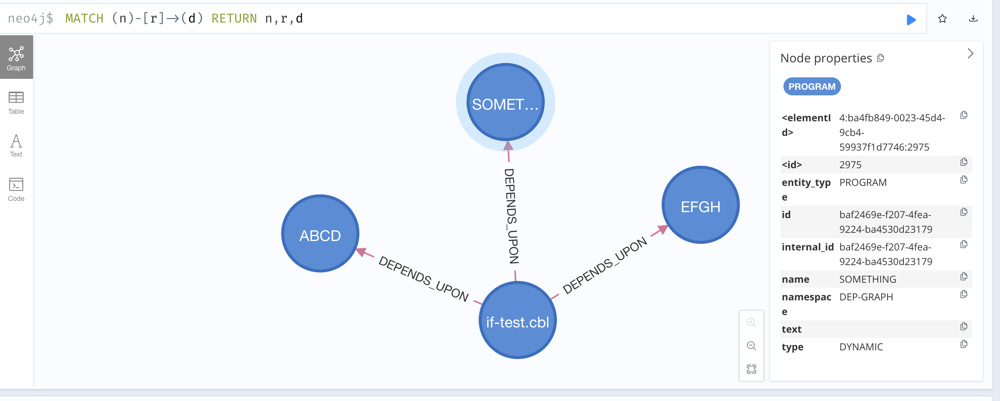

The help text for this command is reproduced below:

```
Usage: app dependency [-hnpV] [-d=<dialect>] [-dp=<dialectJarPath>]
                      -s=<sourceDir> [-x=<exportPath>] -cp=<copyBookDirs>[,
                      <copyBookDirs>...] [-cp=<copyBookDirs>[,
                      <copyBookDirs>...]]... <programName>
Implements various operations useful for reverse engineering Cobol code
      <programName>          The program to analyse
      -cp, --copyBooksDir=<copyBookDirs>[,<copyBookDirs>...]
                             Copybook directories (repeatable)
  -d, --dialect=<dialect>    The COBOL dialect (COBOL, IDMS)
      -dp, --dialectJarPath=<dialectJarPath>
                             Path to dialect .JAR
  -h, --help                 Show this help message and exit.
  -n, --neo4j                Export to Neo4J
  -p, --permissiveSearch     Match filename using looser criteria
  -s, --srcDir=<sourceDir>   The Cobol source directory
  -V, --version              Print version information and exit.
  -x, --export=<exportPath>  Export path
```

#### Command: ```validate```
As an alternative to using the ```--validate``` flag, you can use the ```validate``` command explicitly, like so:

```
java -jar smojol-cli/target/smojol-cli.jar validate minimum.cbl test-exp.cbl --srcDir smojol-test-code/ --copyBooksDir "/path/1/copybooks,/path/1/copybooks" --dialectJarPath che-che4z-lsp-for-cobol-integration/server/dialect-idms/target/dialect-idms.jar --dialect IDMS --output out/validation.json
```

If you specify a path to ```output```, the results will be written to the corresponding file as JSON.

By default, this is non-strict validation, i.e., invalid variable references are reported, but do not cause failure. If the ```--strict``` flag is also specified, invalid variable references in the program will cause the task to fail.

The help text is reproduced below:

```
Usage: app validate [-hptV] [-d=<dialect>] [-dp=<dialectJarPath>]
                    [-o=<outputPath>] -s=<sourceDir> -cp=<copyBookDirs>[,
                    <copyBookDirs>...] [-cp=<copyBookDirs>[,
                    <copyBookDirs>...]]... [<programNames>...]
Validates the candidate COBOL code
      [<programNames>...]    The programs to analyse
      -cp, --copyBooksDir=<copyBookDirs>[,<copyBookDirs>...]
                             Copybook directories (repeatable)
  -d, --dialect=<dialect>    The COBOL dialect (COBOL, IDMS)
      -dp, --dialectJarPath=<dialectJarPath>
                             Path to dialect .JAR
  -h, --help                 Show this help message and exit.
  -o, --output=<outputPath>  Validation results output path
  -p, --permissiveSearch     Match filename using looser criteria
  -s, --srcDir=<sourceDir>   The Cobol source directory
  -t, --strict               Force strict validation, verify all variable
                               usages are valid
  -V, --version              Print version information and exit.
```

#### Command: ```interpret```

To run the interpreter, use the ```interpret``` command, like in the example below. Most of the options overlap with other commands.

```
java -jar smojol-cli/target/smojol-cli.jar interpret test-exp.cbl --srcDir /Users/asgupta/code/smojol/smojol-test-code --copyBooksDir "/Users/asgupta/code/smojol/smojol-test-code" --dialectJarPath /Users/asgupta/code/smojol/che-che4z-lsp-for-cobol-integration/server/dialect-idms/target/dialect-idms.jar --dialect COBOL --resolveTactic=CONSOLE
```

The ```resolveTactic``` parameters are as below:

- ```YES```: Automatically resolved every condition to TRUE
- ```NO```: Automatically resolved every condition to FALSE
- ```CONSOLE```: Wait for user input on the command line to resolve the condition. ```Y``` implies TRUE, all other values resolve to FALSE.
- ```EVAL```: Actually evaluate the condition based on the expressions in it. This is a Work in Progress.

The help text for the ```interpret``` command is reproduced below.

```
Usage: app interpret [-hpV] [-d=<dialect>] [-dp=<dialectJarPath>]
                     -s=<sourceDir> [-t=<resolutionTactic>] -cp=<copyBookDirs>[,
                     <copyBookDirs>...] [-cp=<copyBookDirs>[,
                     <copyBookDirs>...]]... <programName>
Interprets the COBOL source
      <programName>          The program to analyse
      -cp, --copyBooksDir=<copyBookDirs>[,<copyBookDirs>...]
                             Copybook directories (repeatable)
  -d, --dialect=<dialect>    The COBOL dialect (COBOL, IDMS)
      -dp, --dialectJarPath=<dialectJarPath>
                             Path to dialect .JAR
  -h, --help                 Show this help message and exit.
  -p, --permissiveSearch     Match filename using looser criteria
  -s, --srcDir=<sourceDir>   The Cobol source directory
  -t, --resolveTactic=<resolutionTactic>
                             The condition resolution strategy (YES, NO,
                               CONSOLE, EVAL)
  -V, --version              Print version information and exit.
```

### Programmatic Usage

**NOTE: The API is under active development, and may be subject to change.**

The simplest way to invoke tasks associated with the ```CodeTaskRunner``` through the API is using ```CodeTaskRunner```, like so:

```
        CodeTaskRunner codeTaskRunner1 = new CodeTaskRunner("/path/to/src",
                "/path/to/report",
                ImmutableList.of(new File("/path/1/to/cpy"),
                        new File("/path/2/to/cpy"),
                        new File("/path/3/to/cpy")),
                "/path/to/dialect-idms.jar",
                LanguageDialect.IDMS, new FullProgram(PNG), new UUIDProvider(), new OccursIgnoringFormat1DataStructureBuilder(), new ProgramSearch());

```

Depending upon the number of tasks invoked, the result will contain a list of ```AnalysisTaskResult``` objects, which can be either ```AnalysisTaskResultOK``` or ```AnalysisTaskResultError```. You can use them to determine what you want to do.

This invocation uses some specific conventions when deciding where to output file artifacts under the ```report-dir``` directory.
If you want more fine-grained control of the location of output artifacts, you can use the ```SmojolTasks``` class, which gives you more configurability in exchange for having to provide more detailed specifications.

**NOTE:** For all analyses, specifying the ```OccursIgnoringFormat1DataStructureBuilder``` class is preferable to prevent extra noise that can be generated when creating arrays for structures using ```OCCURS``` clauses. However, the ```DefaultFormat1DataStructureBuilder``` should be specified when running the interpreter, because that will require the correct number of elements in array data structures.

Programmatic examples are provided in the following classes.

- See ```FlowChartBuildMain``` for examples of how flowcharts are created.
- See ```InterpreterMain``` for an example of how to run the interpreter on your code, as well as inject execution traces into Neo4J.
- See ```GraphExplorerMain``` for an example of how to inject ASTs, data structures, and CFGs into Neo4J.
- See ```DependencyBuildMain``` for an example how inter-program dependencies can be injected into Neo4J.
- See ```ValidateProgramMain``` for an example of how to run validation through code.
- See ```TranspilerInstructionIntervalAnalysisMain``` and ```BasicBlockIntervalAnalysisMain``` for examples of how T1-T2 analysis is run on ```TranspilerInstruction```s and ```BasicBlock```s, respectively.
- See ```DominatorAnalysisMain``` for an example of how reducibility is tested using DJ trees.
- See ```ImproperSCCsMain``` for an example of how detection of improper Strongly Connected Components is run.

#### Logging Settings

You can specify a custom logging settings file by adding ```-Djava.util.logging.config.file``` option. if not specified, a default ```logging.properties``` will be loaded, with ```INFO``` as the default level.

## Catalogue of Reusable Algorithms

This is a list of algorithms written from scratch, for reference or reuse.

- **Depth First Ordering (Pre- and Post-Order):** Based on [Depth-First Search and Linear Graph Algorithms](https://github.com/tpn/pdfs/blob/master/Depth-First%20Search%20and%20Linear%20Graph%20Algorithms%20-%20Tarjan%20(1972).pdf). See ```DepthFirstTraversalLabelTask```. This does the following things:
  - Generate the explicit **depth-first ordering of nodes**
  - Generate the depth-first **spanning tree**
  - Generates discovery timestamps for determining **node ancestry**
  - **Classifies** all edges in the source graph as **Tree Edges**, **Forward Edges**, **Back Edges**, and **Cross Edges**.
- **Finding Dominators (All and Immediate):** Based on [Graph-Theoretic Constructs for Program Control Flow Analysis - Allen and Cocke](https://dominoweb.draco.res.ibm.com/reports/rc3923.pdf). See ```BuildDominatorsTask```.
- **Interval Analysis via T1-T2 Transforms:** Based on [Characterizations of Reducible Flow Graphs - Hecht and Ullman](https://dl.acm.org/doi/pdf/10.1145/321832.321835). See ```IntervalAnalysisTask```.
- **Building DJ Trees:** Based on the algorithm in [A Linear Time Algorithm for Placing Phi-Nodes](https://dl.acm.org/doi/pdf/10.1145/199448.199464). See ```BuildDJTreeTask```. This task creates edges of three types: ```DominatorEdge```, ```BackJoinEdge```, and ```CrossJoinEdge```.
- **Reducibility Testing using DJ Graphs:** Uses DJ Trees as above. See ```ReducibleFlowgraphTestTask```.
- **Reducible and Irreducible Loop Body detection (WIP):** Based on [Identifying Loops Using DJ Graphs](https://dl.acm.org/doi/pdf/10.1145/236114.236115). See ```LoopBodyDetectionTask```.

## A Note on Copyright

- This toolkit is distributed under the MIT License. However, the Eclipse Cobol Parser project is distributed under the Eclipse Public License V2. Accordingly, all modifications to the parser fall under the EPL v2 license, while the toolkit proper falls under the MIT License.
- The gSpan algorithm implementation is taken from [https://github.com/betterenvi/gSpan](https://github.com/betterenvi/gSpan), which is also under the MIT License.
- The ```RuntimeTypeAdapterFactory``` class code is taken from Google's gson-extras repository. It is under the Apache License v2.0.

## Caveats

- This was built based on a time-boxed PoC, and thus isn't well-covered by tests yet. More are being added on an ongoing basis.
- Cobol is a large language, and thus the interpreter's capabilities are not exhaustive. However, the hope is that the subset currently present is useful enough to get started with reverse engineering legacy code. Obviously, more capabilities are being added on an ongoing basis.
- Visual indicators in picture clauses, like ```-```, ```,```, and ```Z``` are currently ignored.

## Known Issues

- IDMS ```SCHEMA SECTION``` get translated to ```DataDivisionContext``` nodes which have the word ```_SCHEMA_``` as the leading word in their textual description. However, this is not present in the correct child ```DialectNodeFillerContext``` node.
- Expressions in general identifiers (```LENGTH OF...```, etc.) return static values. References to special registers resolve the variable reference (for dependency computations) only resolve one level down.

The rest of this file is mostly technical notes for my personal documentation.

## Valid Type Specifications for External Zoned Decimal and Alphanumeric

| Sym-1 / Sym-2     | S (Sign) | P (Left) | P (Right) | V (Decimal Point) | X (Alphanumeric) | 9 (Number) |
|-------------------|----------|----------|-----------|-------------------|------------------|------------|
| S (Sign)          | -        | X        | X         | X                 | -                | -          |
| P (Left)          | -        | X        | -         | X                 | -                | X          |
| P (Right)         | -        | -        | X         | -                 | -                | -          |
| V (Decimal Point) | -        | -        | X         | -                 | -                | X          |
| X (Alphanumeric)  | -        | -        | -         | -                 | X                | X          |
| 9 (Number)        | -        | -        | X         | X                 | X                | X          |


## Control Flow Notes

- Sentences which are GO TO need to not connect with the immediate next sentence in the code. The internal flow branches off correctly.

### Use the following command to build the Graphviz flowchart:

```dot -Kdot -v5 -Gsize=200,200\! -Goverlap=scale -Tpng -Gnslimit=4 -Gnslimit1=4 -Gmaxiter=2000 -Gsplines=line dotfile.dot -oflowchart-level5.png```

These are some other commands tried on larger graphs:
- ```dot -Kneato -v5 -Tpng dotfile.dot -oflowchart-level5.png```
- ```dot -Kdot -v5 -Gsize=200,200\! -Goverlap=scale -Tpng -Gnslimit=2 -Gnslimit1=2 -Gmaxiter=2000 -Gsplines=line dotfile.dot -oflowchart-level5.png```
- ```dot -Kfdp -v5 -Goverlap=scale -Gsize=200,200\! -Tpng  dotfile.dot -oflowchart-level5.png```
- ```dot -Ktwopi -v5 -Gsize=200,200\! -Tpng  dotfile.dot -oflowchart-level5.png```

### This prints out all levels

```dot -Kdot -v5 -Gsize=200,200\! -Goverlap=scale -Tpng -Gnslimit=4 -Gnslimit1=4 -Gmaxiter=2000 -Gsplines=line dotfile.dot -oflowchart-level5.png```

## References and Inspirations

- Code Structure and Structural Programming
  - [Structured Program Theorem](https://en.wikipedia.org/wiki/Structured_program_theorem)
  - [Advanced Compiler Design and Implementation by Steven Muchnik](https://www.amazon.in/Advanced-Compiler-Design-Implementation-Muchnick/dp/1558603204)
  - [Solving the structured control flow problem once and for all](https://medium.com/leaningtech/solving-the-structured-control-flow-problem-once-and-for-all-5123117b1ee2)
  - [Compilers: Principles, Techniques, and Tools by Aho, Sethi, Ullman](https://www.amazon.in/Compilers-Principles-Techniques-Tools-Updated/dp/9357054111/)
  - [Control Flow Analysis slides](http://www.cse.iitm.ac.in/~krishna/cs6013/lecture4.pdf)
- Dominator Algorithms
  - [Graph-Theoretic Constructs for Program Control Flow Analysis - Allen and Cocke](https://dominoweb.draco.res.ibm.com/reports/rc3923.pdf)
  - [A Fast Algorithm for Finding Dominators in a Flowgraph - Lengauer and Tarjan](https://www.cs.princeton.edu/courses/archive/fall03/cs528/handouts/a%20fast%20algorithm%20for%20finding.pdf)
  - [A Linear Time Algorithm for Placing Phi-Nodes](https://dl.acm.org/doi/pdf/10.1145/199448.199464)
  - [A very readable explanation of the Lengauer-Tarjan algorithm](https://fileadmin.cs.lth.se/cs/education/edan75/F02.pdf)
- Reducibility
  - [Making Graphs Reducible with Controlled Node Splitting](https://dl.acm.org/doi/pdf/10.1145/267959.269971)
  - [Eliminating go to’s while Preserving Program Structure](https://dl.acm.org/doi/pdf/10.1145/48014.48021)
  - [No More Gotos: Decompilation Using Pattern-Independent Control-Flow Structuring and Semantics-Preserving Transformations](https://github.com/lifting-bits/rellic/blob/master/docs/NoMoreGotos.pdf)
- COBOL References
  - [Examples: numeric data and internal representation](https://www.ibm.com/docs/sk/cobol-zos/6.3?topic=data-examples-numeric-internal-representation)
  - [Enterprise Cobol for Z/OS 6.4 - Language Reference](https://publibfp.dhe.ibm.com/epubs/pdf/igy6lr40.pdf)
- Graph Theory
  - [Reducible Flowgraphs 0](https://rgrig.blogspot.com/2009/10/dtfloatleftclearleft-summary-of-some.html)

---
title: Graph Failing
---
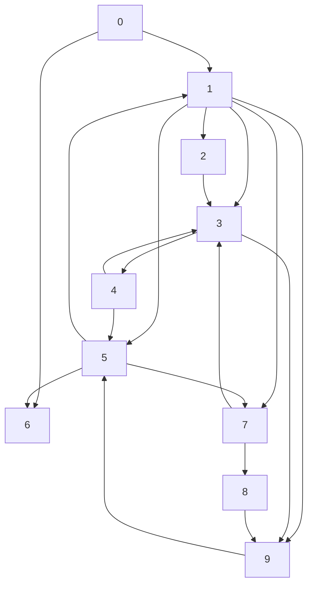

---
title: Graph Working
---
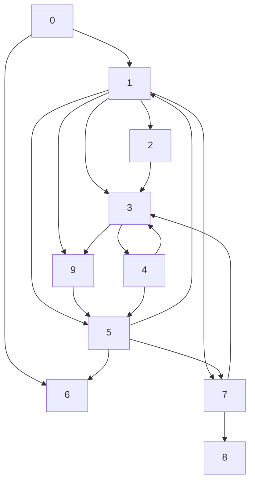
