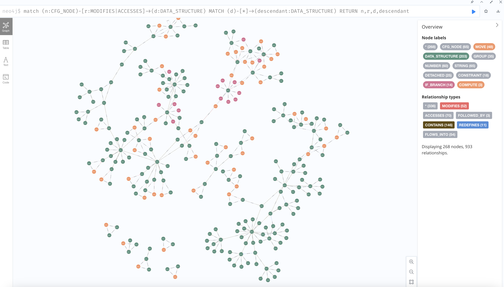
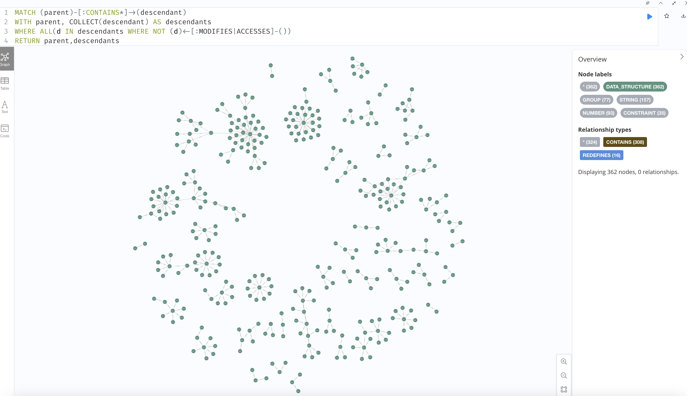

# Neo4J Analysis Catalog

This document lists useful analyses that can be performed through Neo4J. These can substantially reduce the surface area of investigation of an unknown program. These will probably end up being useful functions you can directly call through the code, but for now, this document catalogs useful queries that might aid your reverse engineering effort.

## Variable Trees

As a high-level check, you can find data structures and the code which accesses/modifies them using the following query:

```
MATCH (n)-[r:MODIFIES|ACCESSES]-(d) RETURN n,r,d
```

To find all data influencing-code (accessors and modifiers) as well as the variable trees which are affected (this will require building the CFG in Neo4J).

```
MATCH (n:CFG_NODE)-[r:MODIFIES|ACCESSES]->(d:DATA_STRUCTURE) MATCH (d)-[*]->(descendant:DATA_STRUCTURE) RETURN n,r,d,descendant
```



You can identify unused variable trees (this will require building the CFG in Neo4J) using the following query:

```
MATCH (parent)-[:CONTAINS*]->(descendant)
WITH parent, COLLECT(descendant) AS descendants
WHERE ALL(d IN descendants WHERE NOT (d)<-[:MODIFIES|ACCESSES]-())
RETURN parent,descendants
```



## Code Node Reachability

You may be interested in finding out how two lines of code which modify / access the same variable are related in the program flow. This section shows a couple of ways to do this.

For using Neo4J's Graph Data Science pathfinding algorithms, you will need to create an undirected projection of the graph. Do it one of two ways:

- Create the undirected projection directly. Add all the relations you want to make undirected. The example below shows creating an undirected projection for an AST, which only contains the ```CONTAINS``` relation.

```
CALL gds.graph.project(
  'myGraph',
  ['AST_NODE'],  // Node labels
  {
    CONTAINS: {
      type: 'CONTAINS',
      orientation: 'UNDIRECTED'
    }
  }
)
```

The example below shows creating an undirected projection for an CFG, which only leaves the ```JUMPS_TO``` relation as directed (you can set this to ```UNDIRECTED``` too if you want to find more roundabout join points).

```
CALL gds.graph.project(
  'cfgUndirected',
  ['CFG_NODE'],  // Node labels
  {
    FOLLOWED_BY: {
      type: 'FOLLOWED_BY',
      orientation: 'UNDIRECTED'
    },
    STARTS_WITH: {
      type: 'STARTS_WITH',
      orientation: 'UNDIRECTED'
    },
    JUMPS_TO: {
      type: 'JUMPS_TO',
      orientation: 'NATURAL'
    }
  }
)
```

- Mutate existing relationships to undirected on an existing projected graph. You will need to do this for all the relations you want to modify. The example below shows the query for modifying the ```JUMPS_TO``` relation.

```
CALL gds.graph.relationships.toUndirected(
  'myGraph',
    {relationshipType: 'JUMPS_TO', mutateRelationshipType: 'JUMPS_TO_2'}
)
YIELD
  inputRelationships, relationshipsWritten
```

To find a path between any two code nodes (this will show actual execution paths, as well as unrelated nodes which still share a common join point, upstream or downstream). This will require building the CFG in Neo4J.

```
MATCH (source:CFG_NODE {internal_id: 'CODE_NODE_1_ID'}), (target:CFG_NODE {internal_id: 'CODE_NODE_2_ID'})
CALL gds.shortestPath.dijkstra.stream('myGraph', {
    sourceNode: source,
    targetNodes: target
})
YIELD index, sourceNode, targetNode, totalCost, nodeIds, costs, path
RETURN
    index,
    gds.util.asNode(sourceNode).name AS sourceNodeName,
    gds.util.asNode(targetNode).name AS targetNodeName,
    totalCost,
    [nodeId IN nodeIds | gds.util.asNode(nodeId).name] AS nodeNames,
    costs,
    nodes(path) as path
ORDER BY index
```

Without using pathfinding algorithms explicitly, you can find the common ancestor code node of two code nodes using the following query template (this will require building the AST in Neo4J).

```
MATCH (c1:AST_NODE {internal_id: 'CODE_NODE_1_ID'})
MATCH (c2:AST_NODE {internal_id: 'CODE_NODE_2_ID'})

MATCH path = (c1)<-[:CONTAINS*1..5]-(p:AST_NODE)-[:CONTAINS*1..5]-(c2)
RETURN path
ORDER BY length(path)
LIMIT 1
```

## Miscellaneous Reference

Delete all nodes and relations like so:

```
MATCH (n) OPTIONAL MATCH (n)-[r]-() DELETE n,r
```

Drop projected graphs like so:

```
CALL gds.graph.drop('projectedGraph')
```
